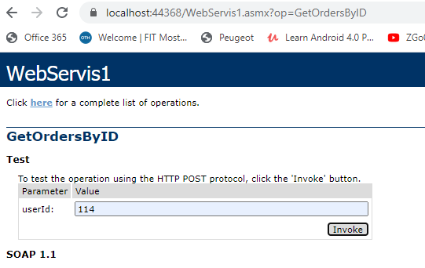
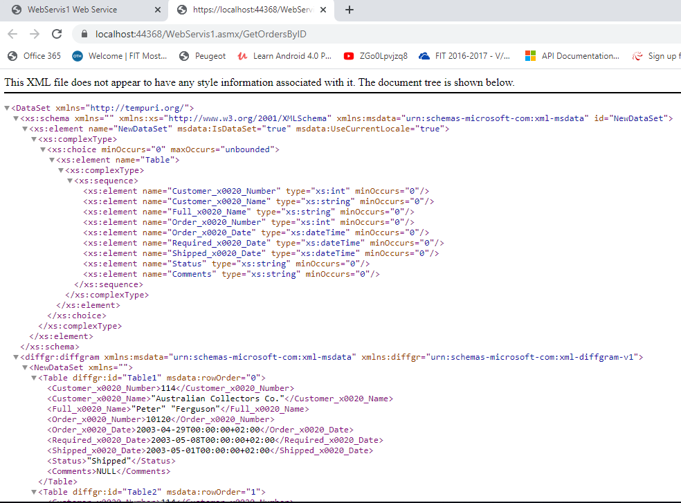
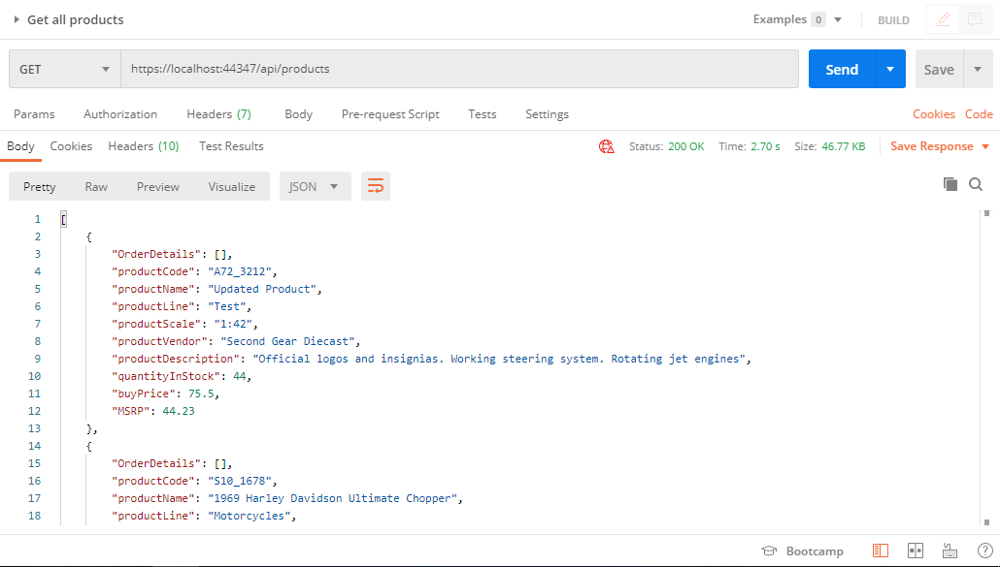
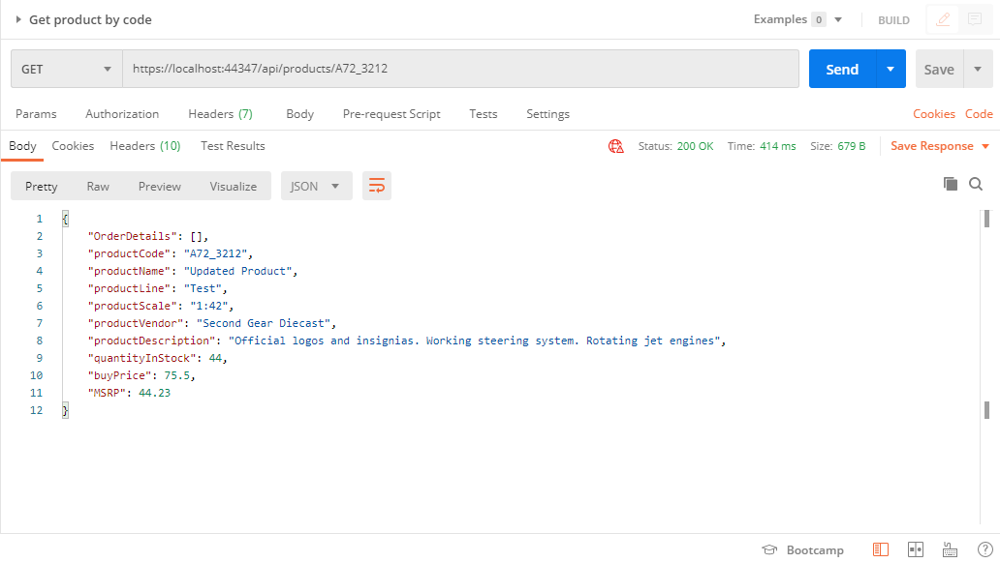
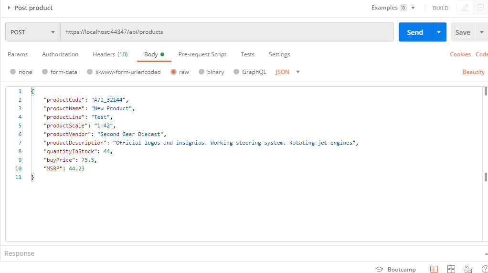
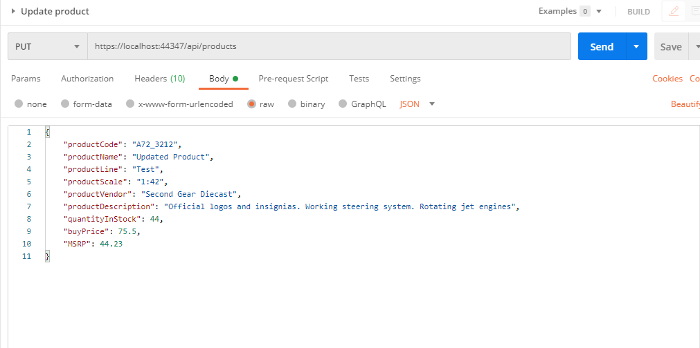
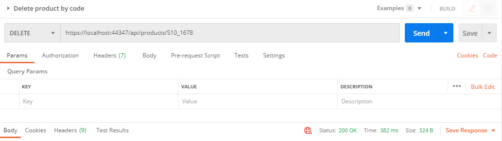

# .NET SOAP i .NET REST projekti se nalaze razdvojeni u folderu _dotnet_

## .NET projekti se povezuju na MS SQL Server i prije pokretanja je potrebno izvrsiti skriptu baze koja se nalazi u root-u, folder _dbscript_ ##

###### U nastavku su prikazani primjeri CRUD operacija u Postmanu ######

###### SOAP/WSDL ######

###### REST CRUD ######

_Get All_

_Get By ID_

_Post_

_Update_

_Delete_

